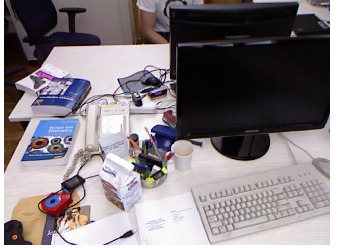

# ORB SLAM for Navigation in Indoor Environment
Final Project for RBE595 - Sensor Fusion & Perception for Autonomous Vehicles

## Dataset
We have used TUM RGB-D Dataset for this project.
  
### Input Image

### Preprocessing

* The ground-truth and RGB images have to be synced first.
* The groundtruth is obtained using motion capture system and the RGB images using a 30HZ camera.

## Pipeline of the ORB SLAM is as follows:
 ### INITIALIZATION
 The initialization procedure consists of initializing map points and pose of the 2nd KeyFrame. For each frame we calculate Homography Matrix and Fundamental Matrix. Then based on a heuristic we choose the model either from Fundamental or Homography Matrix. If not enough map points are formed or there is ambiguity in the poses extracted , we proceed to the next frame for Initialization. Once Initialization is complete, we move on to tracking. Initialization step is the core of robustness for ORB SLAM.

### TRACKING 
Tracking is performed for every frame. First the current frame is matched with the last image, for every point of the last image whose world point is known. Then we construct a local map, which consists of past keyframes. This map is projected on the current frame to search for more matches. Finally, the pose is refined using motion only Bundle Adjustment. Then based on some conditions, such as no of frames passed, no of points in the current frame whose world points are known, we decide wether the current frame is keyframe or not. If it is a keyframe, we move on to the mapping pipeline, else we continue the process of tracking

### MAPPING 
The new keyframe is added. Then we cull the map points which are not seen from more than a few keyframes, in our case it is 3. Then we match the unmatched points from current keyframe with the unmatched points from keyframes in local map and triangulate them to create new map points.

## Results
### Point cloud of a room scene

### Result on TUM Dataset

### The scenes of ORB-SLAM changed on TUM dataset freiburg1_xyz

### Collaborators 
* Joy Mehta - jjmehta1@wpi.edu
* Kunal Nandanwar - kgnandanwar@wpi.edu
* Abizer Patanwala - apatanwala@wpi.edu